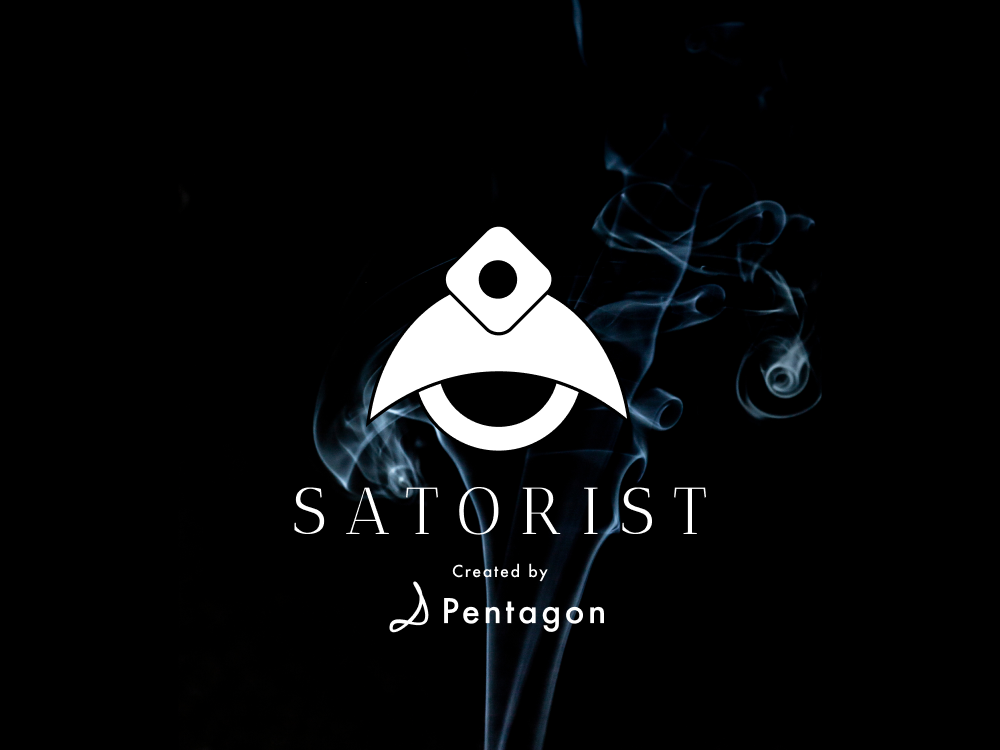

# SATORIST

SATORIST は、テレワークでストレスを抱えやすい現代人のための、瞑想アプリです。  
機械学習により、手間なくストレスレベルの『テスト』を実施し、おすすめの瞑想プログラムを提供します。また、座禅を監視する機能も付いています。

## SetUp

Flutter のバージョン管理に[fvm](https://github.com/leoafarias/fvm)を使用します。

`fvm install`で`.fvm/fvm_config.json`に指定されている Flutter バージョンがインストールされます。

## Architecture

### Sahha

Sahha は、研究機関や大学と一緒に開発された、ストレスレベルを機械学習により判定する AI です。

アンケートや質問に答えるといった面倒なことをせずとも、スマホに蓄積されたデータ（睡眠サイクル、睡眠時間、１日の歩数、心拍数など）をもとに、機械学習により、ストレスや鬱状態を推測することができます。

機械学習の学習データは、37000 件以上の臨床データ、1 億以上のデータによってトレーニングされており、80 ～ 90% 程度の精度で鬱の傾向などを検知できます。

### Apple Health / Android Health

アプリを起動していなくても、バックグラウンドで、スマートフォンに蓄積された健康データを Sahha AI に送ります。ストレスレベルを分析するためのデータとなります。これにより、ユーザーは、アンケートなどに答える必要がなく、自動的にストレスレベルを検知することを可能にします。

### Firebase ML Kit

本アプリでは、Firebase ML Kit を利用して、「半眼」状態を監視しています。

瞑想/座禅における「半眼」とは目を見開いてもなく閉じてもいない心を静めて乱れず集中している状態です。 半分は世間を見つめ、半分は自身の心の内面を見つめることが大切です。

## TestFlight

東京 Flutter ハッカソン中に、テストフライトで配布する段階まで実施しました。
